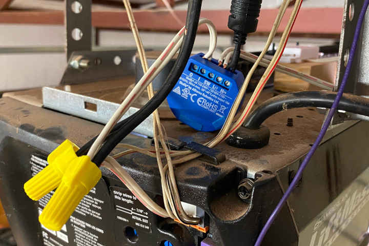
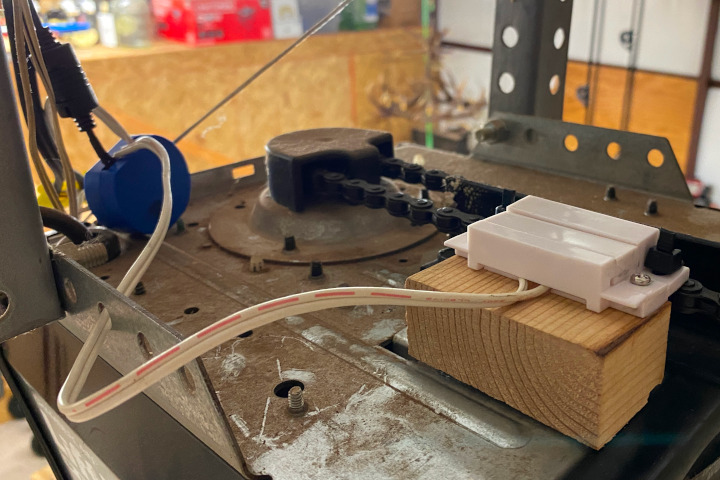

# MQTT Garage Door for Home Assistant

This firmware turns a Shelly 1 into a garage door opener for Home Assistant via the [MQTT Cover](https://www.home-assistant.io/integrations/cover.mqtt/) integration. [platformio.sample.ini](platformio.sample.ini) shows how to configure the project. All options and their defaults can be found in [config.h](include/config.h). No configuration on the Home Assistant side is necessary besides setting up the MQTT integration; all device-specific settings are shared via [MQTT discovery](https://www.home-assistant.io/docs/mqtt/discovery).

Add `upload_protocol = espota` to platformio.ini after flashing the firmware once to enable over-the-air updates. To update OTA a device running the `release` environment with an IP address of 192.168.1.3, you would run

```bash
pio run -e release -t upload --upload-port 192.168.1.3
```

You can also add `upload_port = 192.168.1.3` to platformio.ini instead of using the --upload-port flag.

## Wiring

* Connect a compatible DC power supply (12V or 30-50V) to the L(-) and N(+) terminals.
* Connect a normally-open reed switch to SW and L(-). Make sure the switch is rated for the power supply voltage (most are).
* Splice wires from O and I to the existing wall opener wires.

Example wiring. The Shelly and two wall openers are tied together with wire nuts and connected to the motor. \


Reed switch setup. Be careful to check that when the chain moves the magnet and its zip ties won't hit anything. \


## Other firmware

[MQTT Light](https://github.com/thedanbob/mqtt_light) \
[MQTT Power Cycler](https://github.com/thedanbob/mqtt_power_cycle)
